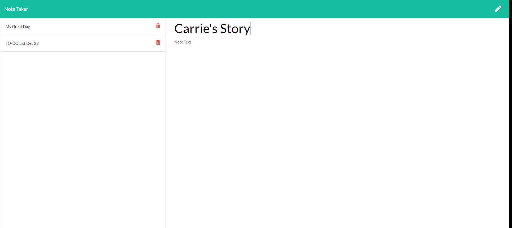

# NoteTaker

This application is designed for users who need to keep track of a lot of information.  It allows the user to write, save, and delete notes. It uses an Express backend server to save and retrieve note data from a JSON file. 

# User Story

AS A user, I want to be able to write and save notes.  
I WANT to be able to delete notes I've written before  
SO THAT I can organize my thoughts and keep track of tasks I need to complete.   

# Installation

No installation required.  Here is a link to the deployed application: https://lit-taiga-83463.herokuapp.com/
 
 

